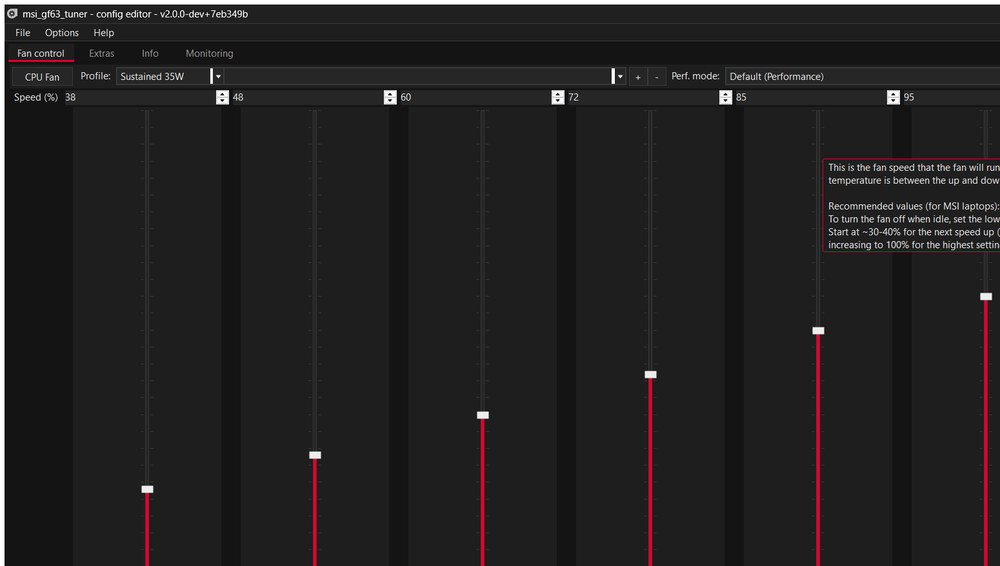
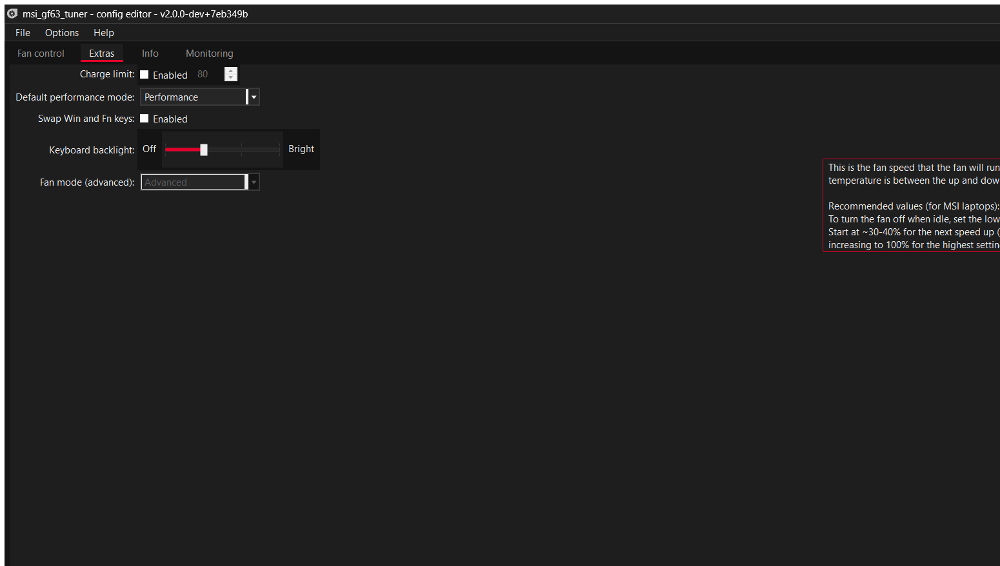

# msi_gf63_tuner

A lightweight fan control and tuning utility for the **MSI GF63 Thin 12HW-004IN**,
replacing MSI Center.

**~950 MB → 6.6 MB. No kernel driver. No background bloat.**

A fork of [YAMDCC](https://codeberg.org/Sparronator9999/YAMDCC) by
Sparronator9999, retargeted at one laptop and fixed until it worked on it.

## ⚠️ Disclaimer — read this first

**Use this at your own risk. If you break your laptop, that is on you, not me.**

- This program writes directly to your laptop's **embedded controller** to
  control the fans, power limits and charging. That is low-level hardware
  access. No warranty of any kind is given — see the GPL, sections 15 and 16.
- **You can overheat your machine with it.** Setting fan speeds too low, or
  thresholds too high, under sustained load can cook your CPU. If you turn the
  fans down and then run something heavy, that is your decision and your
  hardware.
- It is tuned for **one specific laptop** (MSI GF63 Thin 12HW-004IN). Fan curves
  and EC registers vary between models. On a different machine the shipped
  config may be wrong for your hardware.
- This is a **development build** of a fork of an upstream project that is
  itself mid-rewrite. Expect bugs. See [Known issues](#known-issues).
- Do not run this alongside MSI Center. Both write the same registers.
- Not affiliated with, endorsed by, or supported by Micro-Star International
  Co., Ltd. in any way.

**Please do not report problems with this fork to the upstream author**
([Sparronator9999](https://codeberg.org/Sparronator9999)) — the modifications
here are mine, and upstream did not make them.

If you are not comfortable with any of the above, use MSI Center instead.



<details><summary><b>Extras tab</b> (click to expand)</summary>



</details>

## Target hardware

Everything here was measured on this machine, not assumed:

| | |
|---|---|
| Laptop | MSI GF63 Thin 12HW-004IN |
| Board | MS-16R7 |
| BIOS | E16R7IMS.10F |
| EC firmware | `16R7IMS1.104` (2023-06-13) |
| CPU | Intel Core i5-12500H |
| Fans | **one** — `Get_Fan(0)` reports `fan[0]` only |
| Backend | WMI2 (`MSI_ACPI`), WMI version **2.8** |
| Driver | **none** — no WinRing0 |

It will likely work on other WMI2-era MSI laptops, but nothing else has been
tested and no other configs are shipped.

## Features

| | |
|---|---|
| Fan curve control | 7 temperature/speed points, with hysteresis |
| Cooler Boost | full blast toggle |
| Battery charge limit | any value 0–100% |
| Keyboard backlight | off / low / mid / bright |
| Performance mode | Silent, Balanced, Performance, Max Battery |
| Win ↔ Fn key swap | supported |
| Monitoring | CPU/GPU temperature, fan duty and RPM |

Not included (MSI Center features with no equivalent here): Mystic Light RGB,
Super Charger, LAN Manager, Win-key disable, full hardware monitoring.

## Why it uses no driver

MSI Center drives the fans through the `MSI_ACPI` WMI interface — its
`MSIWMIACPI2.dll` contains `MSI_ACPI`, `PNP0C14`, `Set_Fan`, `Set_Temperature`,
`Set_Thermal` and `Set_AP`. This build calls that **same interface**, so it is
not poking unknown registers; it reimplements MSI's own documented path.

That matters because the alternative — WinRing0, a kernel driver — is
[flagged by Windows Defender](https://github.com/Sparronator9999/YAMDCC/discussions/67),
and it was flagged on this machine during development. The installer now
excludes `WinRing0*.sys` from every component except EC Inspector, so a default
install ships no driver at all.

## What this fork changes

### 1. Bug fixes in the WMI2 backend

These are upstream defects on the `v2.0.0-dev` branch, not local workarounds.
They apply to any WMI2 laptop.

- **`GetFanProf()` always returned `null`.** It built the profile, then fell
  through to `return null`. The caller dereferenced null and a bare `catch`
  reported it as a generic failure — which broke **EC-to-config entirely**, the
  one feature needed to support a laptop with no shipped config.
- **`GetEcFirmwareInfo()` never stored the version string.** It was decoded and
  dropped, so every generated config got an empty `<FirmVer>`.
- **`GetChargeLimit()` read the wrong byte** — `result[4]`, the keyboard
  backlight brightness, while set/supported use `result[5]`. It reported the
  key light level as a charge percentage.
- **The GPU fan profile came from the CPU's profile list**
  (`Config.CpuFan.FanProfs[Config.GpuFan.ProfSel]`), applying the CPU curve to
  the GPU fan and throwing `IndexOutOfRangeException` when the lists differed
  in length.
- **The CLI crashed whenever its output was redirected.**
  `Console.BufferWidth` throws when stdout is not a console, so
  `yamdcc.exe -info > out.txt` died before doing anything.

### 2. Dark theme

Windows Forms has no dark mode, so `YAMDCC.Common/UI/` adds one: near-black
`#141414` with MSI red `#E4002B`, and a dark title bar via DWM.

Four controls are Win32 wrappers that ignore `BackColor` entirely and had to be
reimplemented rather than recoloured:

| Control | Problem |
|---|---|
| `DarkTrackBar` | `TrackBar` ignored `BackColor` — a white box on a black form |
| `DarkTabControl` | The strip behind the tabs is system-drawn |
| `DarkComboBox` | The drop-down button stays light even with `FlatStyle.Flat` |
| `DarkToolStripRenderer` | Menu fills come from the renderer's colour table |

Tooltips are owner-drawn too, since a `ToolTip` is a component and never
appears in the control tree.

### 3. Fan curve tuned for a 35 W thin chassis

`Configs-V2/MSI-Thin-GF63-12HW.xml` ships two profiles:

- **Default** — read back from this laptop's own EC, byte for byte. Selecting it
  reproduces factory behaviour exactly.
- **Sustained 35W** — for PL1=35 W / PL2=60 W. Idle stays at the stock 38%, but
  it ramps harder from 65 °C and reaches 100% instead of the factory 85% cap.

| | Tup (°C) | Speed (%) |
|---|---|---|
| Default | 0, 55, 64, 73, 76, 82, 88 | 38, 43, 48, 54, 60, 70, 85 |
| Sustained 35W | 0, 55, 65, 72, 78, 84, 90 | 38, 48, 60, 72, 85, 95, 100 |

`OffsetDT` is `true` on this EC: `Get_Thermal` returns down-threshold
*offsets*, so `Tdown = Tup − offset`.

### 4. Builds without Visual Studio

Upstream expects VS MSBuild. This builds with the plain .NET SDK — see
[BUILD-NOTES-MS16R7.md](BUILD-NOTES-MS16R7.md).

## Measured results

`Sustained 35W` under a 16-thread load:

```
time    CPU    duty  expect    RPM
+12s    85 C    95%    95%    3489
+20s    89 C    95%    95%    4017   <- PL2 burst, 60 W
+24s    73 C    85%    72%    4268   <- PL2 decayed to PL1, 35 W
+160s   77 C    72%    72%    4268   <- steady for 136 s
```

Peak 89 °C, peak 4306 RPM, **39 of 40 samples matched the programmed curve**
(the one miss was the first sample, where temperature rose faster than the fan
could spin up). Cooldown was clean.

## Install

Grab the installer from [Releases](../../releases) and run it. It installs a
service (`yamdccsvc`, LocalSystem, Automatic) plus the config editor.

**MSI Center must not be running.** The service refuses to start alongside
`Micro Star SCM`, `MSI_Center_Service` or `MSI Foundation Service` — it is
strictly either/or, since both write the same EC registers.

Two builds are published:

| Build | Use |
|---|---|
| `Release` | normal use |
| `Debug` | verbose logging, for diagnosing problems |

## Known issues

- **`yamdcc.exe -apply` silently does nothing.** The CLI pushes the IPC message
  then exits immediately; `WaitWrite()` only flushes the local write, so the
  pipe closes before the service reads it. The config is saved but never
  applied — restart the service, or use the GUI's Apply, which stays connected.
  The GUI is unaffected.
- **`Ring0FanController.GetFanProf()` is broken upstream** (`new List<>(n)`
  sets capacity, not count, so its loop never runs). Not fixed here: this fork
  uses the WMI2 backend and never exercises that path.
- **`MessagePack 3.1.4`** carries known advisories. It is only used for the
  local named pipe between service and UI, whose SDDL restricts access to
  SYSTEM and Administrators.
- The **Default** profile is intentionally read-only, so its controls are
  greyed out. That is upstream behaviour, not a bug.

## Credits and licence

All the hard work — the EC reverse engineering, the service, the IPC layer, the
config system — is [Sparronator9999](https://codeberg.org/Sparronator9999)'s.
This fork fixes bugs, adds a theme, and tunes it for one laptop.

GPL-3.0-or-later, unchanged from upstream. Original copyright © 2023–2025
Sparronator9999 and contributors; fork modifications © 2026 kmvishn.
See [LICENSE.md](LICENSE.md).

Third-party libraries: [Json.NET](https://www.newtonsoft.com/json),
[Marked .NET](https://github.com/tomlm/MarkedNet),
[MessagePack](https://github.com/MessagePack-CSharp/MessagePack-CSharp),
a modified [Named Pipe Wrapper](https://github.com/twosense/named-pipe-wrapper),
and [Task Scheduler Managed Wrapper](https://github.com/dahall/taskscheduler).
