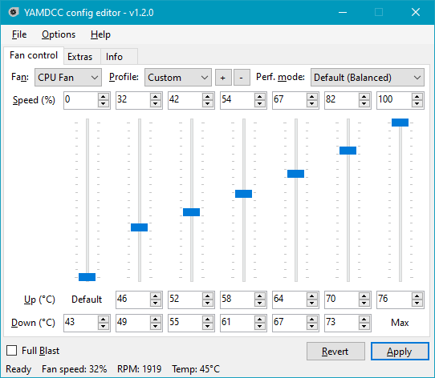
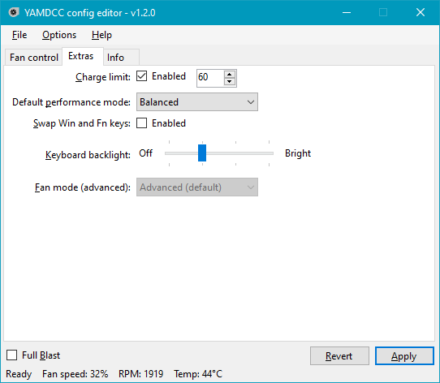
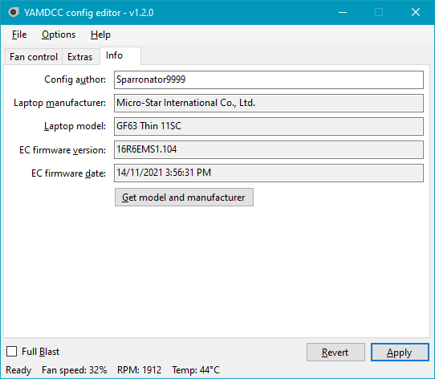
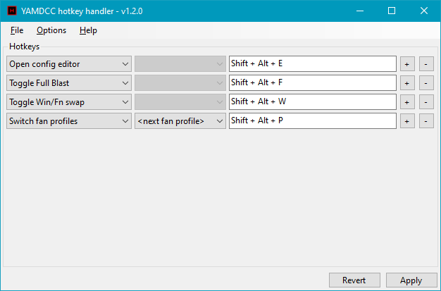

# msi_gf63_tuner

**A fork of [YAMDCC](https://codeberg.org/Sparronator9999/YAMDCC) by Sparronator9999,**
**tuned for the MSI GF63 Thin 12HW-004IN.**

A fast, lightweight MSI Center replacement and fan control utility. On this
laptop it replaces ~950 MB of MSI Center with a **6.6 MB** install that needs
**no kernel driver**.

| | |
|---|---|
| Fork maintainer | kmvishn |
| Upstream | [Sparronator9999/YAMDCC](https://codeberg.org/Sparronator9999/YAMDCC) (GPL-3.0-or-later) |
| Target hardware | MSI GF63 Thin 12HW-004IN — board MS-16R7, BIOS E16R7IMS.10F, EC 16R7IMS1.104 |
| Backend | WMI2 (`MSI_ACPI`), WMI version 2.8 — **no WinRing0** |

## What this fork changes

Upstream is a general-purpose tool for many MSI laptops. This fork targets one
machine and fixes what stopped it working there.

### Bug fixes in the WMI2 backend

These are upstream defects on the `v2.0.0-dev` branch, not local workarounds.
They apply to any WMI2 laptop, not just this one.

1. **`Wmi2FanController.GetFanProf()` always returned `null`.** It built the
   profile then fell through to `return null`, so the caller dereferenced null
   and a bare `catch` reported it as a generic failure. This broke
   **EC-to-config entirely** — the one feature needed to support a laptop that
   has no shipped config.
2. **`GetEcFirmwareInfo()` never stored the version string,** so every
   generated config got an empty `<FirmVer>`.
3. **`GetChargeLimit()` read the wrong byte** (`result[4]`, the keyboard
   backlight brightness) while set/supported use `result[5]` — it reported the
   key light level as a charge percentage.
4. **The GPU fan profile was read from the CPU's profile list**
   (`Config.CpuFan.FanProfs[Config.GpuFan.ProfSel]`), applying the CPU curve to
   the GPU fan and throwing `IndexOutOfRangeException` when the lists differed
   in length.
5. **The CLI crashed whenever its output was redirected.**
   `Console.BufferWidth` throws when stdout is not a console, so
   `yamdcc.exe -info > out.txt` always died before doing anything.

### Known remaining bug

**`yamdcc.exe -apply` silently does nothing.** The CLI pushes the IPC message
then exits immediately; `WaitWrite()` only flushes the local write, so the pipe
closes before the service reads it. The config is saved but never applied — a
service restart (or the GUI's Apply, which stays connected) is needed. The GUI
is unaffected.

### Dark "MSI Dragon" theme

Windows Forms has no dark mode, so `YAMDCC.Common/UI/` adds one: near-black
`#141414` with MSI red `#E4002B`, plus a dark title bar via DWM.

Four controls are Win32 wrappers that ignore `BackColor` and had to be
reimplemented: `DarkTrackBar`, `DarkTabControl`, `DarkComboBox`, and owner-drawn
menus/tooltips.

### Hardware config

`Configs-V2/MSI-Thin-GF63-12HW.xml` — the default profiles were **read back
from this laptop's own EC**, not copied from another model. A second
`Sustained 35W` profile is included for PL1=35 W / PL2=60 W on a single-fan
thin chassis.

### Build changes

Builds with the plain .NET SDK (`dotnet build`), no Visual Studio required —
see [BUILD-NOTES-MS16R7.md](BUILD-NOTES-MS16R7.md).

### Driverless by default

WinRing0 ships in the build output of several projects, so the installer now
excludes `WinRing0*.sys` from every component except EC Inspector, and EC
Inspector is no longer part of the "full" install type. Defender flags that
driver, and it cannot work on a WMI2 laptop anyway.

## Measured on this laptop

Applying the `Sustained 35W` curve under a 16-thread load:

```
CPU 89 C peak during the PL2 burst, fan ramped to 95% duty
then steady at 73-77 C / 72% duty / ~4300 RPM for 136 s once PL1 took over
39 of 40 samples matched the programmed curve exactly
```

## Licence

GPL-3.0-or-later, unchanged from upstream. Original copyright
© 2023-2025 Sparronator9999 and contributors; fork modifications © 2026
kmvishn. See [LICENSE.md](LICENSE.md).

---

*Everything below is upstream's original README, kept for reference. Some of it*
*(installed size, the WinRing0/Defender warning, supported-laptop list) does not*
*describe this fork.*

---

# YAMDCC - Yet Another MSI (Dragon) Center Clone

A fast, lightweight MSI Center alternative and fan control utility for MSI laptops.

**Please read the whole README (or at least the [Supported Laptops](#supported-laptops)**
**and [FAQ](#faq) sections) before downloading.**

> [!IMPORTANT]
> Windows Defender is flagging WinRing0 (the driver YAMDCC uses for EC access) as malware. See [this discussion](https://github.com/Sparronator9999/YAMDCC/discussions/67)  (archived) for more information.
> 
> This is planned to be fixed in v2.0 of YAMDCC by removing the need for WinRing0.

<details><summary>Table of contents <i>(click to expand</i>)</summary>

- [Disclaimers](#disclaimers)
- [Features](#features)
- [Screenshots](#screenshots)
- [Supported laptops](#supported-laptops)
  - [Community-tested laptops](#community-tested-laptops)
- [Comparison](#comparison)
- [Roadmap](#roadmap)
- [Download](#download)
- [Compile](#compile)
- [Issues](#issues)
- [Contributing](#contributing)
- [FAQ](#faq)
- [License and copyright](#license-and-copyright)
- [Third-party libraries](#third-party-libraries)
</details>

## Disclaimers

- This program requires low-level access to some of your computer hardware to
  apply settings. While no issues should arise from this, **I (Sparronator9999)**
  **and any other contributers shall not be held responsible if this program**
  **fries your computer.**
- Additionally, if you do something silly with the program like turn off all
  your fans while running under full load, **we *will not* be held responsible**
  **for *any* damage you cause to your own hardware from your use of this program.**
- Linux is not yet supported. Please don't beg me for Linux support, it will
  come when I can be bothered (and when I figure out how to run background
  services/daemons on Linux).
- This program, repository and its authors are not affiliated with Micro-Star
  International Co., Ltd. in any way, shape, or form.

## Features

- **Fan control:** Change the fan profiles for your CPU and GPU fans, including
  fan speeds, temperature thresholds, and Full Blast (a.k.a. Cooler Boost in
  MSI Center). This allows you to fix a fan profile that isn't aggressive enough
  under full load, turn your fans off when your computer is idle, or just give
  them a boost during CPU-heavy tasks.
- **Performance mode:** MSI laptops have their own performance mode setting
  (not to be confused with Windows' built-in power plans). You can change it here.
- **Charging threshold:** This program can limit how much your laptop's battery
  charges to, which can help reduce battery degradation, especially if you
  leave your laptop plugged in all the time.
- **Lightweight:** YAMDCC takes up less than ten megabytes of disk space when
  installed, and is designed to be light on your laptop's CPU.
- **Configurable:** Almost all settings (including those not accessible through
  the config editor) can be changed with the power of XML.

## Screenshots



<details><summary><b>More screenshots</b> (click to expand)</summary>








</details>

## Supported Laptops

Currently, there are configs for the following laptops:

  - MSI Alpha 17 C7VF (thanks @SethCodingInc)
  - MSI Bravo 15 B7ED (thanks @VisionCrizzal)
  - MSI Bravo 17 C7VE (thanks @advait404)
  - MSI Crosshair 17 B12UGZ (thanks @ios7jbpro)
  - MSI GF63 Thin 11SC
  - MSI Katana GF66 12UG (thanks @porkmanager)
  - MSI Modern 15 A5M (thanks @tedomi2705)
  - MSI Stealth 15M A11SDK (thanks @l1ngu)
  - MSI Stealth GS76 11UG (thanks @gemSquared)
  - MSI Titan GT77HX 13VH (thanks @noteMASTER11)
  - MSI Vector 16 HX A14VHG (thanks @KamykJr)
  - MSI Vector 16 HX AI A2XWIG (thanks @Peter42R)

There are also generic configs that should work with most MSI laptops, but with
an incorrect default config. You can use the EC-to-config feature to get the
proper fan profiles for your laptop. This will be made the default behaviour in
a future version of YAMDCC.

Other laptop brands are not supported. You're probably looking for
[NoteBook FanControl](https://github.com/UraniumDonut/nbfc-revive) instead.

### Community-tested laptops

The following laptops have been tested by the community and are confirmed to be
working, but don't have their own public YAMDCC configs. A suggested generic
config is provided below:

- MSI GF75 Thin 9SC (thanks @Lieglein96): `MSI-9th-gen-or-older-dualfan.xml`
- MSI Raider GE66 12UGS (thanks @grimy400): `MSI-10th-gen-or-newer-dualfan.xml`
- MSI Vector 17 HX A14VHG (thanks @injitools): `MSI-10th-gen-or-newer-dualfan-nokeylight.xml`
- MSI Vector GP78 HX 13V (thanks @Twisted6 and @TheSingular): `MSI-10th-gen-or-newer-dualfan-nokeylight.xml`

To test your laptop, go to the [config tutorial](https://codeberg.org/Sparronator9999/YAMDCC/wiki/How-to-make-a-config-for-YAMDCC)
wiki page and follow the instructions to get a config for your laptop.

## Comparison

| Feature                       | MSI Center | YAMDCC      |
|-------------------------------|------------|-------------|
| Installed size¹               | ~950 MB    | ~5.9 MB     |
| Fan control                   | ✔          | ✔           |
| Temp. threshold control       | ❌          | ✔           |
| Multi-fan profile support     | ❌          | ✔           |
| Charge limit setting          | Limited²   | ✔           |
| Perf. mode setting            | ✔          | ✔           |
| Win/Fn key swap               | ✔          | ✔³          |
| Win key disable               | ✔          | ❌           |
| Keyboard backlight adjustment | ❌          | ✔⁴          |
| Hardware monitoring           | ✔          | Limited⁵    |
| Other MSI Center features     | ✔          | ❌           |
| Open source                   | ❌          | ✔           |

1: As of v2.0.38, MSI Center takes about 950 MB of storage space when counting
the UWP app (749 MB) and the files installed on first launch to
`C:\Program Files (x86)\MSI` (205 MB). YAMDCC's installed size is based on the
Release build of [v1.2](https://codeberg.org/Sparronator9999/YAMDCC/releases/tag/v1.2.0)
when installed normally (plus uninstaller) with all components selected
(the default).

2: MSI Center only supports setting the charge limit to 60%, 80%, 100%, or
auto-select based on usage. YAMDCC can set the charge limit to anything between
0 and 100% (with 0 meaning charge to 100% always), but not auto-select based on
usage.

3: Not supported by older MSI laptops under YAMDCC. Not sure about MSI Center,
however.

4: Not supported by laptops without a keyboard backlight (obviously), or by
any laptop with an RGB keyboard backlight.

5: YAMDCC only supports monitoring the CPU/GPU temperatures and fan speeds via EC.

## Roadmap

### v2.0

- [ ] Re-write config system *(in progress)*
  - YAMDCC was originally written to allow anyone to add support for their own
    laptop brands (by changing which and how many EC registers are written),
    however since then it has added many features specific to MSI laptops.
  - The new config system would simplify configs by removing register configs
    (mandatory for WMI-based access) and only storing user settings (custom fan
    profiles, charge threshold, etc.)
  - Old configs would most likely be incompatible, but migration to v2.0 should
    be easy with a migrator app/script.
  - Since there are two main EC generations for MSI laptops, the user can be
    asked when their laptop was released until detection is implemeted
    (see next feature).
- [x] Switch to WMI for EC access
  - WMI2-based laptops (those with a "2nd-gen" EC) are fully implemented.
  - WMI1-based laptops will likely not be supported at this stage, as they are
    missing a lot of features that YAMDCC uses unless direct EC access via
    WinRing0 is used.
- [ ] Streamline setup process
  - Currently users have to download a config, but v2.0 will change this to
    automatically set up a new config for the laptop.

### v2.1

- [ ] Support for keyboard mic/speaker mute LEDs
  - Apparently this isn't handled by hardware/Windows, but after
    [reverse-engineering Apple's Boot Camp](https://codeberg.org/Sparronator9999/OpenBootCamp)
    to get keyboard shortcuts working without its original Boot Camp Manager
    app (drivers are still required), I really shouldn't be surprised anymore.
  - If you have information on how these work, please comment on [this issue](https://codeberg.org/Sparronator9999/YAMDCC/issues/82).
    - I am already aware of BeardOverflow's Linux EC driver for MSI laptops,
      and will look to this first.
  - This feature was originally considered for v2.0, but due to the scope of
    the v2.0 rewrite, this will be done in v2.1 instead now.
- [ ] GPU switch support
  - Research for this feature has stalled. Since my laptop doesn't appear to
    support this feature, this may be removed from the planned features in the
    future unless someone else figures out how to control the GPU switch
    without MSI Center/Feature Manager.
  - Comment on [this issue](https://codeberg.org/Sparronator9999/YAMDCC/issues/74) if you know how to get this working without MSI Center.

**No new features are planned after this.** If you previously asked for a
feature that I accepted and it isn't listed above (or below), please contact
me on [Matrix](https://matrix.to/#/@sparronator9999:matrix.org) or by commenting
on your original feature request issue (I should receive a notification for the
latter).

### Previously planned features

The following features were previously planned to be included, but are
**no longer being considered**:

- ~~[ ] Plugin system for additional optional features~~
- ~~[ ] .NET support~~
- ~~[ ] Linux support~~

Plugin and .NET >= 5 support are no longer being considered as it isn't worth
the grind for me, as I will be moving to Linux once the v2.1 features are
complete (hopefully).

If you use Linux, give [MControlCenter](https://github.com/dmitry-s93/MControlCenter)
a try. I may write a script/app to convert between the two config formats at
some point.

## Download

Releases are available from [the Releases tab](https://codeberg.org/Sparronator9999/YAMDCC/releases).

Development builds are currently unavailable, due to lack of CI implementation at this time. Until a solution is implemented, you must [compile the program yourself](#compile).

## Compile

See the [wiki page](https://codeberg.org/Sparronator9999/YAMDCC/wiki/Compiling).

### Using Visual Studio

1.  Install Visual Studio 2022 with the `.NET Desktop Development` workload checked.
2.  Download the code repository, or clone it with `git`.
3.  Extract the downloaded code, if needed.
4.  Open `YAMDCC.sln` in Visual Studio.
5.  Click `Build` > `Build Solution` to build everything.
6.  Your output, assuming default build settings, is located in `YAMDCC.ConfigEditor\bin\Debug\net48\`.
7.  ???
8.  Profit!

Make sure to only use matching `yamdccsvc.exe` and `ConfigEditor.exe`/`yamdcc.exe`
together, otherwise you may encounter issues (that means `net stop yamdccsvc`
first, then compile).

### From the command line

1.  Follow steps 1-3 above to install Visual Studio and download the code.
2.  Open `Developer Command Prompt for VS 2022` and `cd` to your project directory.
3.  Run `msbuild /t:restore` to restore the solution, including NuGet packages.
4.  Run `msbuild YAMDCC.sln /p:platform="Any CPU" /p:configuration="Debug"` to
    build the project, substituting `Debug` with `Release` if you want a
    release build instead.
5.  Your output should be located in `YAMDCC.ConfigEditor\bin\Debug\net48\`,
    assuming you built with the above unmodified command.
6.  ???
7.  Profit!

## Issues

If your question isn't already answered in the [FAQ](#faq) or [issues megathread](https://codeberg.org/Sparronator9999/YAMDCC/issues/1),
and there isn't already another similar issue in [the issue tracker](https://codeberg.org/Sparronator9999/YAMDCC/issues),
feel free to open an issue. Please make sure to use the correct issue template for your problem.

## Contributing

See the [compile instructions](#compile) to build this project.

If you would like to contribute to the project with bug fixes, new features,
or new configs, feel free to open a pull request. Please include the following:

- **Bug fixes/improvements/new feature:** Describe the changes you made and why they
  are important or useful.
- **New config:** Add a config with your laptop's default fan profile so that
  other people don't have to run the EC-to-config tool.

## FAQ

This section has been moved to the [wiki](https://codeberg.org/Sparronator9999/YAMDCC/wiki/FAQ).

## License and Copyright

Copyright © 2023-2025 Sparronator9999.

This program is free software: you can redistribute it and/or modify it under
the terms of the GNU General Public License as published by the Free Software
Foundation, either version 3 of the License, or (at your option) any later
version.

This program is distributed in the hope that it will be useful, but WITHOUT ANY
WARRANTY; without even the implied warranty of MERCHANTABILITY or FITNESS FOR A
PARTICULAR PURPOSE. See the [GNU General Public License](LICENSE.md) for more
details.

## Third-party Libraries

This project makes use of the following third-party libraries:

- [Json.NET (Newtonsoft.Json)](https://www.newtonsoft.com/json) to parse
  obtained release manifests from GitHub.
- [Marked .NET](https://github.com/tomlm/MarkedNet) to parse release changelogs.
- [A modified version of twosense's Named Pipe Wrapper fork](https://github.com/twosense/named-pipe-wrapper)
  for communication between the service and UI program (called `YAMDCC.IPC` in
  the source files).
  - [MessagePack](https://github.com/MessagePack-CSharp/MessagePack-CSharp) for safe(r) message serialisation than .NET's obsolete [BinaryFormatter](https://learn.microsoft.com/en-us/dotnet/standard/serialization/binaryformatter-security-guide).
- [Task Scheduler Managed Wrapper](https://github.com/dahall/taskscheduler) to
  schedule automatic update checks.
- [WinRing0](https://github.com/QCute/WinRing0) for low-level hardware access
  required to read/write the EC.

## Special thanks

- The [r/MSILaptops](https://redlib.catsarch.com/r/MSILaptops) subreddit for thinking YAMDCC is good enough to deserve a pinned post.
- @porkmanager for basically being my personal bug bounty hunter.
- [Everyone who has starred this project](https://www.star-history.com/#Sparronator9999/YAMDCC&Date) on GitHub.
  - Now, just need to get back those stars on Codeberg...
