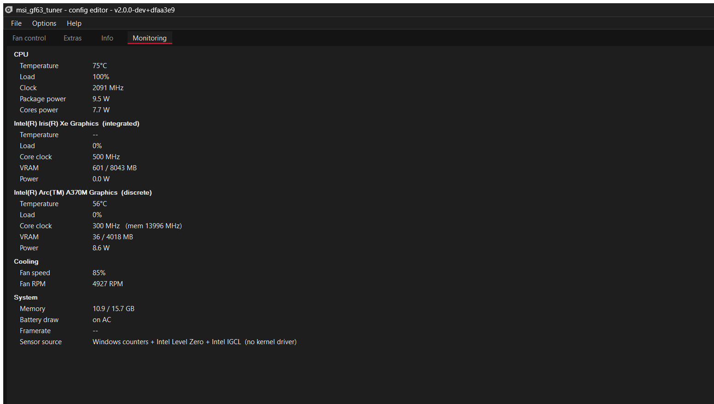
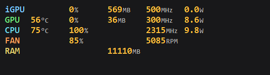

# msi_gf63_tuner

A lightweight fan control, tuning and hardware monitoring utility for the
**MSI GF63 Thin 12HW-004IN**, replacing MSI Center — and, on this machine, MSI
Afterburner too.

**~950 MB → 7 MB. No kernel driver. No background bloat.**

A fork of [YAMDCC](https://codeberg.org/Sparronator9999/YAMDCC) by
Sparronator9999, retargeted at one laptop and fixed until it worked on it.

## ⚠️ Disclaimer — read this first

**Use this at your own risk. If you break your laptop, that is on you, not me.**

- This program writes directly to your laptop's **embedded controller** to
  control the fans, power limits and charging. That is low-level hardware
  access. No warranty of any kind is given — see the GPL, sections 15 and 16.
- **You can overheat your machine with it.** Setting fan speeds too low, or
  thresholds too high, under sustained load can cook your CPU. If you turn the
  fans down and then run something heavy, that is your decision and your
  hardware.
- It is tuned for **one specific laptop** (MSI GF63 Thin 12HW-004IN). Fan curves
  and EC registers vary between models. On a different machine the shipped
  config may be wrong for your hardware.
- This is a **development build** of a fork of an upstream project that is
  itself mid-rewrite. Expect bugs. See [Known issues](#known-issues).
- Do not run this alongside MSI Center. Both write the same registers.
- Not affiliated with, endorsed by, or supported by Micro-Star International
  Co., Ltd. in any way.

**Please do not report problems with this fork to the upstream author**
([Sparronator9999](https://codeberg.org/Sparronator9999)) — the modifications
here are mine, and upstream did not make them.

If you are not comfortable with any of the above, use MSI Center instead.




<details><summary><b>Extras tab, and the desktop overlay</b> (click to expand)</summary>


The overlay, floating over everything else on screen (shown here against a
blank dark window so the labels are legible):



</details>

## Target hardware

Everything here was measured on this machine, not assumed:

| | |
|---|---|
| Laptop | MSI GF63 Thin 12HW-004IN |
| Board | MS-16R7 |
| BIOS | E16R7IMS.10F |
| EC firmware | `16R7IMS1.104` (2023-06-13) |
| CPU | Intel Core i5-12500H |
| iGPU | Intel Iris Xe Graphics |
| dGPU | Intel Arc A370M |
| Fans | **one** — `Get_Fan(0)` reports `fan[0]` only |
| Backend | WMI2 (`MSI_ACPI`), WMI version **2.8** |
| Driver | **none** — no WinRing0, no RTCore64 |

It will likely work on other WMI2-era MSI laptops, but nothing else has been
tested and no other configs are shipped. The GPU monitoring is Intel-specific
(see [Hardware monitoring](#4-hardware-monitoring-without-a-kernel-driver));
on an NVIDIA machine those rows will be empty while everything else still works.

## Features

| | |
|---|---|
| Fan curve control | 7 temperature/speed points, with hysteresis |
| Cooler Boost | full blast toggle |
| Battery charge limit | any value 0–100% |
| Keyboard backlight | off / low / mid / bright |
| Performance mode | Silent, Balanced, Performance, Max Battery |
| Win ↔ Fn key swap | supported |
| Hardware monitoring | CPU and **both** GPUs: temperature, load, clocks, VRAM, power |
| Desktop overlay | click-through always-on-top readout |
| In-game OSD | optional, via RivaTuner Statistics Server |

Not included (MSI Center features with no equivalent here): Mystic Light RGB,
Super Charger, LAN Manager, Win-key disable.

## Why it uses no driver

MSI Center drives the fans through the `MSI_ACPI` WMI interface — its
`MSIWMIACPI2.dll` contains `MSI_ACPI`, `PNP0C14`, `Set_Fan`, `Set_Temperature`,
`Set_Thermal` and `Set_AP`. This build calls that **same interface**, so it is
not poking unknown registers; it reimplements MSI's own documented path.

That matters because the alternative — WinRing0, a kernel driver — is
[flagged by Windows Defender](https://github.com/Sparronator9999/YAMDCC/discussions/67),
and it was flagged on this machine during development. The installer now
excludes `WinRing0*.sys` from every component except EC Inspector, so a default
install ships no driver at all.

The same rule was applied to monitoring. MSI Afterburner reads its sensors
through **RTCore64.sys**, and bundling that was considered and rejected:

- It has an [unfixed arbitrary ring-0 read/write vulnerability](https://nvd.nist.gov/vuln/detail/CVE-2019-16098)
  (CVE-2019-16098) and is on Microsoft's vulnerable-driver blocklist, so
  shipping it would install a known local privilege-escalation primitive.
- It is proprietary and not redistributable, which is incompatible with this
  project's GPL-3 licence.

So every reading below comes from an interface Windows or Intel already
exposes to user mode. Nothing is installed to get them.

## What this fork changes

### 1. Bug fixes

These are upstream defects on the `v2.0.0-dev` branch, not local workarounds.
They apply to any WMI2 laptop.

- **`GetFanProf()` always returned `null`.** It built the profile, then fell
  through to `return null`. The caller dereferenced null and a bare `catch`
  reported it as a generic failure — which broke **EC-to-config entirely**, the
  one feature needed to support a laptop with no shipped config.
- **`GetEcFirmwareInfo()` never stored the version string.** It was decoded and
  dropped, so every generated config got an empty `<FirmVer>`.
- **`GetChargeLimit()` read the wrong byte** — `result[4]`, the keyboard
  backlight brightness, while set/supported use `result[5]`. It reported the
  key light level as a charge percentage.
- **The GPU fan profile came from the CPU's profile list**
  (`Config.CpuFan.FanProfs[Config.GpuFan.ProfSel]`), applying the CPU curve to
  the GPU fan and throwing `IndexOutOfRangeException` when the lists differed
  in length.
- **The CLI crashed whenever its output was redirected.**
  `Console.BufferWidth` throws when stdout is not a console, so
  `yamdcc.exe -info > out.txt` died before doing anything.
- **`SetPerfMode()` did nothing.** It wrote the `Get_AP(1)` packet, which this
  EC silently ignores — the byte did not even stick, and the effective mode
  (read from `Get_AP(0)[3]`) never changed. After a cold boot the laptop sat in
  whatever mode the EC defaulted to (**Silent** on a GF63 Thin 12HW) regardless
  of the config. Now writes the `Get_AP(0)` packet, like every other setter on
  this interface.
- **The hotkey handler could never autostart.** The installer declared a Run
  key `ValueName` with no `ValueData`, writing an empty string that started
  nothing — and even with the path filled in it would still have failed, because
  `HotkeyHandler.exe` is manifested `requireAdministrator` and an
  `HKLM\...\Run` entry cannot elevate. Replaced with a logon **scheduled task**
  running at highest privileges, which starts it elevated with no UAC prompt.
- **Shortcuts were awkward.** The app was buried as
  `msi_gf63_tuner\Config Editor`, so typing the program's name in the Start menu
  found a folder rather than something launchable, and desktop icons were off by
  default. Now a top-level Start menu entry and a desktop icon, both on by
  default.

### 2. Dark theme

Windows Forms has no dark mode, so `YAMDCC.Common/UI/` adds one: near-black
`#141414` with MSI red `#E4002B`, and a dark title bar via DWM.

Four controls are Win32 wrappers that ignore `BackColor` entirely and had to be
reimplemented rather than recoloured:

| Control | Problem |
|---|---|
| `DarkTrackBar` | `TrackBar` ignored `BackColor` — a white box on a black form |
| `DarkTabControl` | The strip behind the tabs is system-drawn |
| `DarkComboBox` | The drop-down button stays light even with `FlatStyle.Flat` |
| `DarkToolStripRenderer` | Menu fills come from the renderer's colour table |

Tooltips are owner-drawn too, since a `ToolTip` is a component and never
appears in the control tree.

The per-profile **Perf. mode** selector was also dropped from the Fan control
tab. It duplicated the global one on Extras and caused confusion about which of
the two actually applied; the per-profile value is still read and written in the
config, it is simply no longer a second control competing with the first.

### 3. Fan curve tuned for a 35 W thin chassis

`Configs-V2/MSI-Thin-GF63-12HW.xml` ships two profiles:

- **Default** — read back from this laptop's own EC, byte for byte. Selecting it
  reproduces factory behaviour exactly.
- **Sustained 35W** — for PL1=35 W / PL2=60 W. Idle stays at the stock 38%, but
  it ramps harder from 65 °C and reaches 100% instead of the factory 85% cap.

| | Tup (°C) | Speed (%) |
|---|---|---|
| Default | 0, 55, 64, 73, 76, 82, 88 | 38, 43, 48, 54, 60, 70, 85 |
| Sustained 35W | 0, 55, 65, 72, 78, 84, 90 | 38, 48, 60, 72, 85, 95, 100 |

`OffsetDT` is `true` on this EC: `Get_Thermal` returns down-threshold
*offsets*, so `Tdown = Tup − offset`.

### 4. Hardware monitoring, without a kernel driver

The **Monitoring** tab replaces what MSI Afterburner was installed for. Both
GPUs are enumerated and reported separately — the integrated Iris Xe and the
discrete Arc A370M — alongside the CPU, the fan, memory and power state:

```
CPU                             75 °C   100%   2091 MHz   9.5 W pkg / 7.7 W cores
Intel Iris Xe (integrated)        --      0%    500 MHz    601 / 8043 MB    0.0 W
Intel Arc A370M (discrete)      56 °C     0%    300 MHz     36 / 4018 MB    8.6 W
Cooling                                  85%   4927 RPM
System                          10.9 / 15.7 GB   on AC
```

Every value comes from an interface that is already present on the machine:

| Reading | Source |
|---|---|
| CPU package / cores power | Windows **Energy Meter** performance counters (`RAPL_Package0_*`), in-box |
| CPU load, clock | `Processor Information` counters |
| CPU temperature | the EC, via the same WMI2 `Get_Temperature` call used for the fan curve |
| Adapter identity, VRAM size | **DXGI** `IDXGIFactory1::EnumAdapters1` |
| GPU load, VRAM in use | `GPU Engine` / `GPU Adapter Memory` counters, matched to each adapter by LUID |
| GPU core and memory clock, Arc temperature | **Intel Level Zero** sysman (`ze_loader.dll`, shipped with the driver) |
| GPU power and voltage | **Intel IGCL** (`ControlLib.dll`, from the driver store) |
| Fan duty and RPM | the service, over the existing named pipe |
| Frame rate | RivaTuner Statistics Server, if it happens to be running |

The tab shows which of these are live on the **Sensor source** line, so it is
obvious when a reading is missing because an interface is absent rather than
because the value is zero.

Two details that cost the most time to get right, in case they are useful
elsewhere:

- The RAPL counters report **energy in nanojoules and time in milliseconds**,
  and they only update about once a second. Sampling them over a 250 ms window
  gave 6.97 W where the true figure was 16.82 W. Readings are now held until at
  least 900 ms of counter time has elapsed.
- `GPU Adapter Memory\Dedicated Usage` reads **zero** on this hardware; the
  real figure is in `Shared Usage`, because the Arc is on a shared-memory
  design. Reporting "dedicated" would have shown 0 MB permanently.

If MSI Afterburner *is* running, its shared memory is read and used where it
overlaps, so nothing is lost by keeping it. It is no longer needed: the Arc
power figure read through IGCL (8.91 W) matched Afterburner's own reading
(8.6–8.7 W) on the same idle desktop.

### 5. Overlay and in-game OSD

**Options ▸ Show overlay** puts the same readings in a borderless,
click-through, always-on-top window in the corner of the screen. It is a normal
top-most window — nothing is injected into anything — so it draws over the
desktop and over windowed and borderless-windowed games, which is how most
modern titles run.

It cannot draw over a game in **exclusive fullscreen**. That mode bypasses the
desktop compositor entirely, and the only way around it is to inject a DLL and
hook the Direct3D present call. That is what RivaTuner does, and it is both
invasive and the kind of behaviour anti-cheat software is built to detect, so
it is deliberately not done here.

For those cases, **Options ▸ Show in-game OSD (RTSS)** publishes the same text
into RivaTuner Statistics Server's shared memory, which draws it inside the
game. RTSS is optional and is only needed for exclusive fullscreen; note that
RTSS hooks games, so check your game's anti-cheat policy before using it.

Both toggles can be set at startup, for a shortcut that launches straight into
a readout:

```
ConfigEditor.exe --overlay
ConfigEditor.exe --overlay --osd
```

The sensor poll follows whatever is actually displayed, so closing the window
to the tray while the overlay is up keeps the overlay updating, and with
nothing shown nothing is polled.

### 6. Builds without Visual Studio

Upstream expects VS MSBuild. This builds with the plain .NET SDK — see
[BUILD-NOTES-MS16R7.md](BUILD-NOTES-MS16R7.md).

## Measured results

`Sustained 35W` under a 16-thread load:

```
time    CPU    duty  expect    RPM
+12s    85 C    95%    95%    3489
+20s    89 C    95%    95%    4017   <- PL2 burst, 60 W
+24s    73 C    85%    72%    4268   <- PL2 decayed to PL1, 35 W
+160s   77 C    72%    72%    4268   <- steady for 136 s
```

Peak 89 °C, peak 4306 RPM, **39 of 40 samples matched the programmed curve**
(the one miss was the first sample, where temperature rose faster than the fan
could spin up). Cooldown was clean.

## Install

Grab the installer from [Releases](../../releases) and run it. It installs a
service (`yamdccsvc`, LocalSystem, Automatic) plus the config editor.

**MSI Center must not be running.** The service refuses to start alongside
`Micro Star SCM`, `MSI_Center_Service` or `MSI Foundation Service` — it is
strictly either/or, since both write the same EC registers.

Two builds are published:

| Build | Use |
|---|---|
| `Release` | normal use |
| `Debug` | verbose logging, for diagnosing problems |

## Known issues

- **The overlay cannot appear over exclusive-fullscreen games.** This is a
  deliberate limitation, not a bug — see
  [Overlay and in-game OSD](#5-overlay-and-in-game-osd).
- **The Iris Xe reports no temperature and 0.0 W.** It has no sensor of its
  own: it sits on the CPU die and its power is already counted in the CPU
  package figure. The row is kept so its load, clock and memory use are visible.
- **Framerate shows `--` unless RivaTuner Statistics Server is running.**
  Frame rate can only be measured from inside the game's present loop, which is
  exactly the hooking this build does not do.
- **`yamdcc.exe -apply` silently does nothing.** The CLI pushes the IPC message
  then exits immediately; `WaitWrite()` only flushes the local write, so the
  pipe closes before the service reads it. The config is saved but never
  applied — restart the service, or use the GUI's Apply, which stays connected.
  The GUI is unaffected.
- **`Ring0FanController.GetFanProf()` is broken upstream** (`new List<>(n)`
  sets capacity, not count, so its loop never runs). Not fixed here: this fork
  uses the WMI2 backend and never exercises that path.
- **`MessagePack 3.1.4`** carries known advisories. It is only used for the
  local named pipe between service and UI, whose SDDL restricts access to
  SYSTEM and Administrators.
- The **Default** profile is intentionally read-only, so its controls are
  greyed out. That is upstream behaviour, not a bug.

## Credits and licence

All the hard work — the EC reverse engineering, the service, the IPC layer, the
config system — is [Sparronator9999](https://codeberg.org/Sparronator9999)'s.
This fork fixes bugs, adds a theme and a monitoring stack, and tunes it for one
laptop.

GPL-3.0-or-later, unchanged from upstream. Original copyright © 2023–2025
Sparronator9999 and contributors; fork modifications © 2026 kmvishn.
See [LICENSE.md](LICENSE.md).

Third-party libraries: [Json.NET](https://www.newtonsoft.com/json),
[Marked .NET](https://github.com/tomlm/MarkedNet),
[MessagePack](https://github.com/MessagePack-CSharp/MessagePack-CSharp),
a modified [Named Pipe Wrapper](https://github.com/twosense/named-pipe-wrapper),
and [Task Scheduler Managed Wrapper](https://github.com/dahall/taskscheduler).
